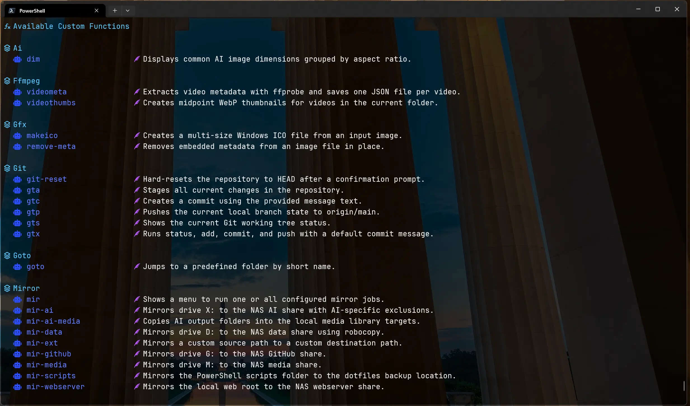

# dotfiles-win

Personal Windows configuration files

These are my user-specific configuration files that I use to personalize my Windows experience.



## What is included

- PowerShell profile and aliases  
- Windows Terminal settings  
- Helper scripts  
- Git configuration  
- Visual Studio Code settings and extensions  
- Explorer and UI tweaks  
- Optional WSL and developer tools setup  

## Purpose

These dotfiles help me keep a consistent, efficient workflow across any Windows system I use, whether it is a fresh install, a dev workstation, or a virtual machine.

## Usage

> **Caution**  
> The files are tuned to my preferences. Review and adapt them before applying to your own system.

### Clone

```bash
git clone https://github.com/YOUR_USERNAME/dotfiles-win.git
